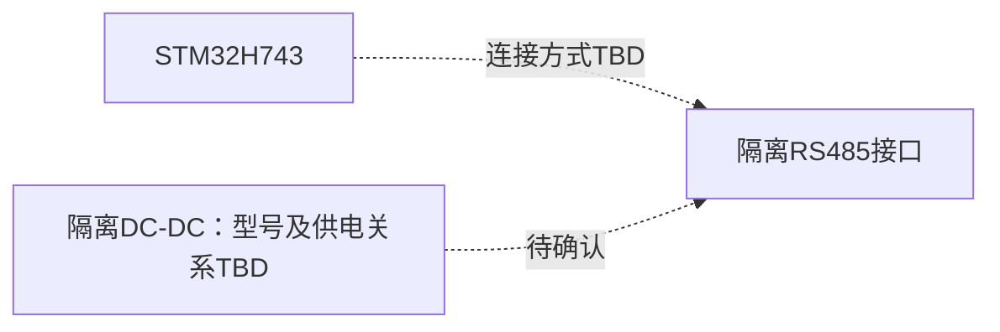

# 系统总体架构

已知模块为STM32H743及隔离RS485接口；连接方式与供电实现尚未提供，图中明确标为TBD。

```mermaid
flowchart LR
    MCU["STM32H743"] -.->|"连接方式TBD"| IF["隔离RS485接口"]
    P["隔离DC-DC：型号及供电关系TBD"] -.->|"待确认"| IF
```

虚线表示待确认关系，不能作为原理图接线依据。详见[隔离接口设计](../05_硬件详细设计/隔离RS485模块设计_26_11_13.md)。
